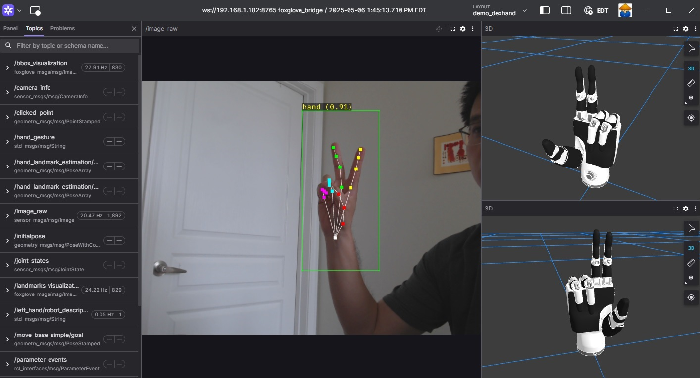

# RZ/V Demo DexHand

This package provides launch files and configurations for demonstrating dexterous hand control on Renesas RZ/V platforms. It integrates vision-based pose estimation with both virtual and physical hand control.

## Overview

The RZ/V Demo DexHand package enables:
- Hand landmark estimation and interpretation
- Simultaneous control of virtual and physical dexterous hands
- Visualization through Foxglove Studio
## Package Dependencies

### Vision and Perception
- `rzv_pose_estimation`: Provides pose estimation capabilities on Renesas RZ/V platforms
- `v4l2_camera`: Camera interface for video capture
- `foxglove_keypoint_publisher`: Publishes keypoints for visualization

### Hand Control and Visualization
- `arm_hand_control`: Core control logic for the dexterous hand
- `inspire_rh56_urdf`: URDF models for the Inspire RH56 dexterous hand
- `robot_state_publisher`: Publishes TF information based on joint states
- `tf2_ros`: Transform library for coordinate frames

### Visualization Bridge
- `foxglove_bridge`: Bridges ROS 2 to Foxglove Studio for visualization


## Prerequisites
### Hardware Requirements:
- [RZV2H-EVK Board](https://www.renesas.com/en/design-resources/boards-kits/rz-v2h-evk) - Renesas RZ/V platform
- USB camera for hand tracking
- Inspire RH56 DexHand connected via serial port (for physical hand demo)
- Network access (Ethernet)
- USB serial (optional for debugging)
- SD Card (using eSD boot) at least 16GB recommended
### Software requirements:
- A host machine running:
    - `Docker` – used for isolated and repeatable builds
    - `Git` – to clone repositories
    - `SSH` – for remote interaction and deployment to the target board
- Cross-Compiling Scripts: A complete guide and supporting scripts for **Cross-Compiling ROS2 Projects for RZ/V2H Using Yocto SDK and Docker**.
- Prebuilt Yocto SDK for RZ/V2H with ROS 2 packages:
    - The prebuilt SDK (.sh installer) includes all the required ROS 2 packages for the Jazzy distribution, ready for cross-compilation.
    - `poky-glibc-*.target.manifest`: A list of available target-side packages installed in the target root filesystem.
- Ubuntu-based Root Filesystem Image
- ROS 2 workspace source code

## Quick Setup Guide
### 1. Setup Environment
Prepare the hardware and verify the connection between the RZ/V2H board and the host PC.

- Power up the board using SD card
- Connect board to host via Ethernet
- Ensure SSH access is working
- Recommended: serial console for debugging

Please refer to the file for further details: [Quick Setup Environment for RZ/V2H EVK Board](doc/setup_environment.md)
### 2. Cross Compilation
Cross-compile the ROS 2 application using the provided script.
- Clone project repositories to your host machine
- Prepare the ROS 2 workspace layout
- Run the provided build script to:
  - Creating docker
  - Install the Yocto SDK environment
  - Cross build the application
- Deploy the build output to the target via SSH

The final binaries will be located in `~/ros2_ws/install/` on the board

Please refer to the file for further details: [Cross Compiling for The Dexhand Demo](doc/cross_compiling.md)


## Installation the DexHand demo

This section explains how to install the ROS 2 workspace and the DexHand demo on the RZ/V2H EVK board.
- Ensure the target board has successfully booted into the Ubuntu-based OS from microSD
- Your development machine can establish an SSH connection to the target board.
- The `install/` directory (from cross-compilation) has been deployed to the board, typically under `/home/rzpi/ros2_ws/install`


**Note:**
> If you intend to run only the Inspire RH56 DexHand demo, you only need to focus on the `inspire_rh56_urdf` and `inspire_rh56_dexhand` folders,
> and ignore the `ruiyan_rh2_controller`, `ruiyan_rh2_urdf`, and `ruiyan_rh2_dexhand` folders.
> Conversely, if you intend to run only the RuiYan RH2 DexHand demo, focus on the RuiYan RH2 folders and ignore the Inspire RH56 ones.
>
> On the provided pure Ubuntu image for the RZ/V2H board, `ros-jazzy-ros-base` has already been installed
> Additionally, the demo packages were built during the [cross compilation process](#2-cross-compilation).
> So, you can skip these steps [(1)](#1-ros2-jazzy-installation) [(2)](#2-demo-packages-installation), and proceed to step [(3)](#3-rzv-ros2-package-dependencies-installation).
### 1. ROS2 Jazzy Installation
Before installing the package dependencies, ensure you have ROS 2 Jazzy installed on your Ubuntu system:

```bash
# Update package index and install ROS 2 Jazzy base
sudo apt update
sudo apt install ros-jazzy-ros-base
```
For detailed installation instructions, follow the [official ROS2 Jazzy installation guide](https://docs.ros.org/en/jazzy/Installation/Ubuntu-Install-Debs.html).
### 2. Demo Packages Installation
Before running the demos, ensure all required dependencies are installed:

```bash
# Clone and build all required packages in your workspace
cd <your_ros2_ws>/src
git clone <repository_url_for_arm_hand_control>
git clone <repository_url_for_foxglove_keypoint_publisher>
git clone <repository_url_for_rzv_demo_dexhand>
git clone <repository_url_for_rzv_model>
git clone <repository_url_for_rzv_pose_estimation>

# For Inspire RH56 Dexhand demo
git clone <repository_url_for_inspire_rh56_urdf>
git clone <repository_url_for_inspire_rh56_dexhand>

# For Ruiyan RH2 Dexhand Demo
git clone <repository_url_for_ruiyan_rh2_controller>
git clone <repository_url_for_ruiyan_rh2_urdf>
git clone <repository_url_for_ruiyan_rh2_dexhand>

# Build the workspace
cd <your_ros2_ws>
colcon build --cmake-args -DCMAKE_BUILD_TYPE=Release
```

### 3. RZV ROS2 Package Dependencies Installation

Download the `libtvm_runtime.so` file from the official repository:
[libtvm_runtime.so – GitHub (Renesas RZ TVM v2.5.0)](https://github.com/renesas-rz/rzv_drp-ai_tvm/tree/v2.5.0/obj/build_runtime/V2H)
```bash
wget https://github.com/renesas-rz/rzv_drp-ai_tvm/raw/refs/heads/v2.5.0/obj/build_runtime/V2H/libtvm_runtime.so
```
Install the TVM TOOLCHAIN runtime library:
```bash
sudo mv libtvm_runtime.so /usr/lib/aarch64-linux-gnu/renesas
```
### 4. Install Package Dependencies
Use `rosdep` to install all required dependencies:
```bash
# Initialize and update rosdep (only required once per system)
sudo rosdep init
rosdep update

#Install dependencies for the following common packages
rosdep install \
    --from-paths install/arm_hand_control \
                 install/foxglove_keypoint_publisher \
                 install/rzv_demo_dexhand \
                 install/rzv_pose_estimation \
    --ignore-src -r -y

#Install dependencies for the Inspire RH56 Dexhand demo
rosdep install \
    --from-paths install/inspire_rh56_urdf \
                 install/inspire_rh56_dexhand \
    --ignore-src -r -y

#Install dependencies for the RuiYan RH2 Dexhand demo
rosdep install \
    --from-paths install/ruiyan_rh2_controller \
                 install/ruiyan_rh2_urdf \
                 install/ruiyan_rh2_dexhand \
    --ignore-src -r -y
```

### 5. Load the workspace
You must source the setup script to make the packages visible to ROS:
```bash
# Source ROS2 in the current shell
source /opt/ros/jazzy/setup.bash

source <your_ros2_ws>/install/setup.bash
```

## Run the DexHand demo
### Connection Hardware
Connect both the USB camera and the physical DexHand to the USB ports on the board.
To access the physical DexHand through the serial port, the user needs permission to access `/dev/ttyUSB0`:

```bash
# Add your user to the dialout group to enable access to /dev/ttyUSB0
sudo usermod -a -G dialout $USER
```
**Note:**
> For RZ/V2H EVK, there are USB 2.0 and USB 3.0 ports.
> USB camera needs to be connected to appropriate port based on its requirement.

### Setup Hardware

Based on the hardware currently in use — **Inspire RH56** or **Ruiyan RH2** — please run the following script to load the required kernel module or initialize hardware communication:

- **Inspire RH56**:
  `install/rzv_demo_dexhand/share/rzv_demo_dexhand/setup/inspire_rh56_init.sh`

- **Ruiyan RH2**:
  `install/rzv_demo_dexhand/share/rzv_demo_dexhand/setup/ruiyan_rh2_init.sh`

If you are using different hardware, please create your own setup script accordingly.

### Run the Demo

To launch the virtual hands demo:

```bash
ros2 launch rzv_demo_dexhand demo_virtual_hands.launch.py
```

To launch the physical Inspire RH56 hand control demo:

```bash
ros2 launch rzv_demo_dexhand demo_physical_hand.launch.py [video_device:=/dev/video0] [serial_port:=/dev/ttyUSB0]
```

To launch the physical RuiYan RH2 hand control demo:

```bash
ros2 launch rzv_demo_dexhand demo_physical_ruiyan_rh2_hand.launch.py [video_device:=/dev/video0] [can_port:=can2]
```

### Launch Arguments
- `video_device`: Specify the camera device (default: `/dev/video0`)
- `landmark_model_type`: Type of hand landmark model to use (default: `mediapipe_hand_landmark`, others: `rtmpose_hand`, `hrnetv2_hand_landmark`)
- `serial_port`: Serial port for the physical Inspire RH56 DexHand (default: `/dev/ttyUSB0`, only for `demo_physical_hand.launch.py`)
- `can_port`: Can port for the physical RuiYan RH2 DexHand (default: `can2`, only for `demo_physical_ruiyan_rh2_hand.launch.py`)


## Launch Files

#### demo_virtual_hands.launch.py

This launch file sets up a camera-based hand tracking system that controls virtual Inspire RH56 hands:

```
PIPELINE:
camera → hand landmark estimation → hand landmark/gesture interpreters → urdf visualization

TOPIC FLOW:
- Camera publishes: /image_raw
- Hand landmark estimation subscribes to: /image_raw and publishes: /hand_landmark_estimation/bounding_box, /hand_landmark_estimation/hand_landmarks
- Visualization nodes subscribe to landmarks/bbox and publish visualizations
- Hand interpreters subscribe to: /hand_landmark_estimation/hand_landmarks and publish: /joint_states
- URDF publishers use joint states to visualize the hands
```

Components included in this launch file:
1. **Camera Node**: Captures video input for hand tracking
2. **Hand Landmark Estimation**: Detects hands and extracts landmark points
3. **Visualization Nodes**: Create visual representations for Foxglove Studio
4. **Hand Landmark Interpreter**: Converts detected landmarks to joint states
5. **Hand Gesture Interpreter**: Alternative control method using gesture recognition
6. **URDF State Publishers**: Visualize both right and left hands
7. **Foxglove Bridge**: Enables visualization through Foxglove Studio

#### demo_physical_hand.launch.py

This launch file extends the virtual hand demo to also control a physical Inspire RH56 dexterous hand:

```
PIPELINE:
camera → hand landmark estimation → hand landmark/gesture interpreters → urdf visualization + real hand control

TOPIC FLOW:
- Camera publishes: /image_raw
- Hand landmark estimation subscribes to: /image_raw and publishes: /hand_landmark_estimation/bounding_box, /hand_landmark_estimation/hand_landmarks
- Visualization nodes subscribe to landmarks/bbox and publish visualizations
- Hand interpreters subscribe to: /hand_landmark_estimation/hand_landmarks and publish: /joint_states
- URDF publishers use joint states to visualize the hands
- Physical hand controller uses joint states to control the real DexHand
```

Components included in this launch file:
1. **Camera Node**: Captures video input for hand tracking
2. **Hand Landmark Estimation**: Detects hands and extracts landmark points
3. **Visualization Nodes**: Create visual representations for Foxglove Studio
4. **Hand Landmark Interpreter**: Converts detected landmarks to joint states
5. **Hand Gesture Interpreter**: Alternative control method using gesture recognition
6. **URDF State Publishers**: Visualize both right and left hands
7. **Real Hand Control**: Controls physical Inspire RH56 DexHand via serial connection
8. **Foxglove Bridge**: Enables visualization through Foxglove Studio

#### demo_physical_ruiyan_rh2_hand.launch.py

This launch file extends the virtual hand demo to also control a physical RuiYan RH2 dexterous hand:

Pipeline:
camera → hand landmark estimation → hand landmark/gesture interpreters → urdf visualization + real hand control

Topic flow:
- Camera: publishes /image_raw
- Hand landmark estimation: subscribes to /image_raw
    publishes /hand_landmark_estimation/bounding_box, /hand_landmark_estimation/hand_landmarks
- Visualization: subscribes to landmarks/bbox and publishes visualization markers
- Hand landmark interpreter: subscribes to /hand_landmark_estimation/hand_landmarks
    publishes /joint_states
- Hand gesture interpreter: subscribes to /hand_landmark_estimation/hand_landmarks
    publishes /joint_states (alternative control method)
- URDF publishers: subscribe to /joint_states for hand visualization
- Ryuyan RH2 DexHand: Perform message conversion: subscribes to /joint_states, publishes /ryhand6_cmd
- Physical hand controller: subscribes to /ryhand6_cmd to control the real DexHand


## Visualization with Foxglove Studio

The demo can be visualized using Foxglove Studio by connecting to the Foxglove Bridge websocket.

#### Using the Preset Layout

For the best visualization experience, a preset panel layout is provided:

1. Start Foxglove Studio
2. Connect to the Foxglove Bridge websocket (typically `ws://localhost:8765`)
3. Click on "Layouts" in the top menu
4. Select "Import layout from file"
5. Navigate to the `config/foxglove/demo_dexhand.json` file in the rzv_demo_dexhand package
6. Click "Open" to load the preset layout

The preset layout provides:
- Camera view with hand landmark overlays
- 3D visualization of the virtual hands
- Joint state monitoring panels
- Custom panels configured specifically for the dexterous hand demo

This layout ensures all the necessary visualization components are properly set up without manual configuration.

#### Demo Visualization



The image above shows the Foxglove Studio interface with the preset layout loaded, displaying the camera feed with hand landmark overlays and the 3D visualization of the virtual hands.

## License
Apache License 2.0
