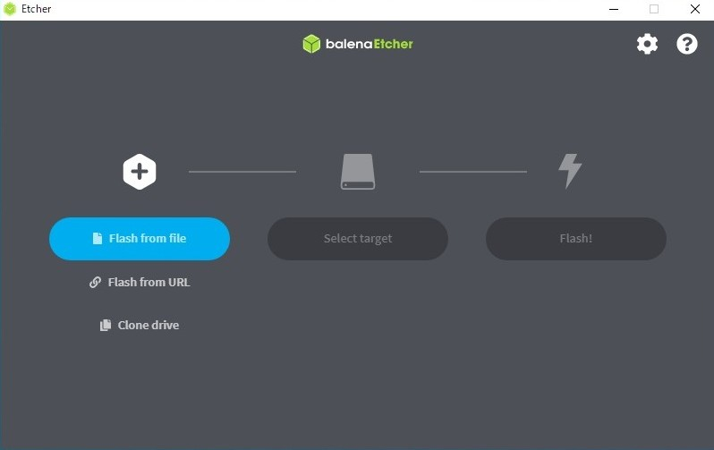
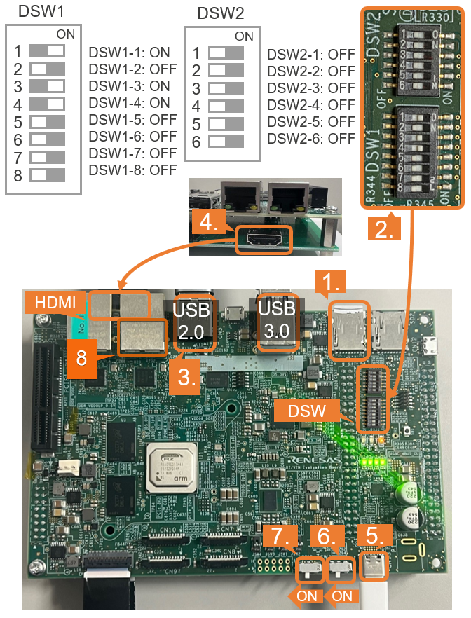

#  Environment Setup Guide
This quick start guide focuses on booting the board using a **microSD card**, which is the most straightforward method.  
Other advanced boot methods such as **xSPI flash** or **TFTP + NFS boot** are also supported, but not covered in detail here.

> For information on advanced boot options, please refer to the official documentation in the [Reference](#reference) section below.
## Preparing the SD Card
To boot the RZ/V2H board using a microSD card, you must first flash a bootable Linux image onto it.

### Requirements
- Flash script: Provided script to flash image 
- Balena Etcher: GUI-based tool to flash image 
- A microSD card (at least **16 GB** recommended)
- Two provided bootable Linux images
    |File name                              | Using                     |Platform support   |
    |---------------------------------------|---------------------------|-------------------|
    |renesas-ubuntu-rzv2h-evk.tar.bz2       | Flash script              |Linux              |
    |renesas-ubuntu-rzv2h-evk.zip           | Balena Etcher application |Windows/macOS/Linux|
### Option 1: Using flash script (Linux)
#### Identify the Device Node
After inserting the microSD card into your host PC, run:
```bash
lsblk
```
Example output:
```qgsql
NAME MAJ:MIN RM SIZE RO TYPE MOUNTPOINT
sda 8:0 0 30.9G 0 disk
├─sda1 8:1 0 512M 0 part /boot/efi
├─sda2 8:2 0 1K 0 part
└─sda5 8:5 0 30.3G 0 part /
sdb 8:16 1 29.7G 0 disk         <-- This is your SD card 
```
In this case, the following are your microSD card components:
- `/dev/sdb`: The device name for the entire microSD card.  
#### Run the Flash Script
Use the flash script to write the OS image to the SD card:

```bash
./sd_flash.sh /dev/sdb <path/to/your/renesas-ubuntu-rzv2h-evk.tar.bz2>
```
**Note:**
>   Make sure you replace /dev/sdb with the correct device name.

Expected successful output:
```bash
SD card prepared successfully for eSD boot
```
### Option 2: Flash Using Balena Etcher (Windows/macOS/Linux)
Balena Etcher is a user-friendly GUI tool to flash OS images to SD cards and USB drives.  
It provides a simple and safe method, especially for beginners.  

#### Install Balena Etcher
Download and install the software from the [Balena Etcher Official Website](https://etcher.balena.io/)
#### Flashing the Image
Once Etcher is open:  

- **Select Image:** Click "Flash from file" and choose your image file (e.g., renesas-ubuntu-rzv2h-evk.zip)
- **Select Target:**
    Insert your SD card and choose the correct device (e.g., /dev/sdb).
    > If using this software on Linux platform. Please confirm the name of device of SD card carefully.  
    > Double-check to avoid overwriting your main disk  
- **Flashing:**
    Click "Flash" to begin. Etcher will:

    - Write the image

    - Validate the image

    - Automatically unmount the SD card
- **Finish:** Remove the SD card safely after Etcher reports successful completion

## Boot Mode Configuration (Jumpers & DIP Switch)
Before powering up the RZ/V2H EVK, make sure the board's boot mode is configured correctly using the DIP switches or boot jumpers.

The board supports multiple boot options, including:

| Boot Source | Description               | Boot Mode (DIP SW/Jumpers)  |
|-------------|---------------------------|-----------------------------|
| microSD     | Boot from SD card         | Set to SD mode              |
| xSPI        | Boot from xSPI flash      | Set to xSPI mode            |

> **Important:** Always power off the board before changing boot switches.

### DIP Switch Settings for SD Card boot mode


1. Insert the microSD card to the Board. (Use the micro card slot SD1)
2. Change DSW1 and DSW2 setting as shown in the figure
3. Connect peripherals devices
4. Connect an HDMI monitor (optional)
5. Connect the power supply  

Turn on power switches:

6.  Flip **SW3** to `ON` (main power) 
7.  Flip **SW2** to `ON` (power-on signal)
8. Connect the Ethernet Port2
(The default IP address is 192.168.1.10)

The board will begin booting.
> Make sure the switches are toggled in the correct direction according to the silkscreen on the board. 
---
### Verifying System Boot and SSH Access

After powering on the board, connect via serial console and check the boot log to verify that it has successfully booted into the Ubuntu system.  
Alternatively, if the board is reachable over the network, you can confirm it is running by connecting via SSH.

**Network Connectivity**

```bash
#From your host side:
ping 192.168.1.10

ssh rzpi@192.168.1.10
```
**Note:**
> The default password for the `rzpi` user is `1`
# Reference
- Advanced Boot Options (e.g., xSPI): [Renesas RZ/V AI | Detailed guide for advanced boot methods.](https://renesas-rz.github.io/rzv_ai_sdk/5.20/dev_guide.html#D3)
- eSD Setup Bootup: [Renesas RZ/V AI | The best solution for starting your AI applications.](https://renesas-rz.github.io/rzv_ai_sdk/5.20/getting_started_v2h.html#step7-3)

- Balena Etcher Official Website: [https://www.balena.io/etcher](https://www.balena.io/etcher)